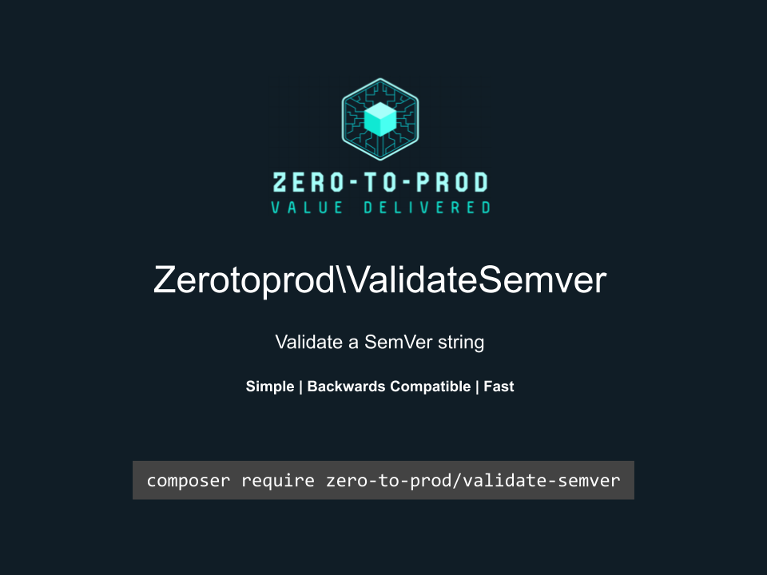

# Zerotoprod\ValidateSemVer



[](https://github.com/zero-to-prod/validate-semver)
[](https://github.com/zero-to-prod/validate-semver/actions)
[](https://packagist.org/packages/zero-to-prod/validate-semver/stats)
[](https://packagist.org/packages/zero-to-prod/validate-semver/stats)
[](https://packagist.org/packages/zero-to-prod/validate-semver)
[](https://github.com/zero-to-prod/validate-semver/blob/main/LICENSE.md)
[](https://wakatime.com/badge/github/zero-to-prod/validate-semver)
[](https://hitsofcode.com/github/zero-to-prod//validate-semver/view?branch=main)

Validates a SemVer string.

## Installation

Install the package via Composer:

```bash
composer require zero-to-prod/validate-semver
```

## Usage

Returns true if the value is a valid SemVer string.

```php
Zerotoprod\ValidateSemVer\ValidateSemVer::isValid('1.0.0')
```